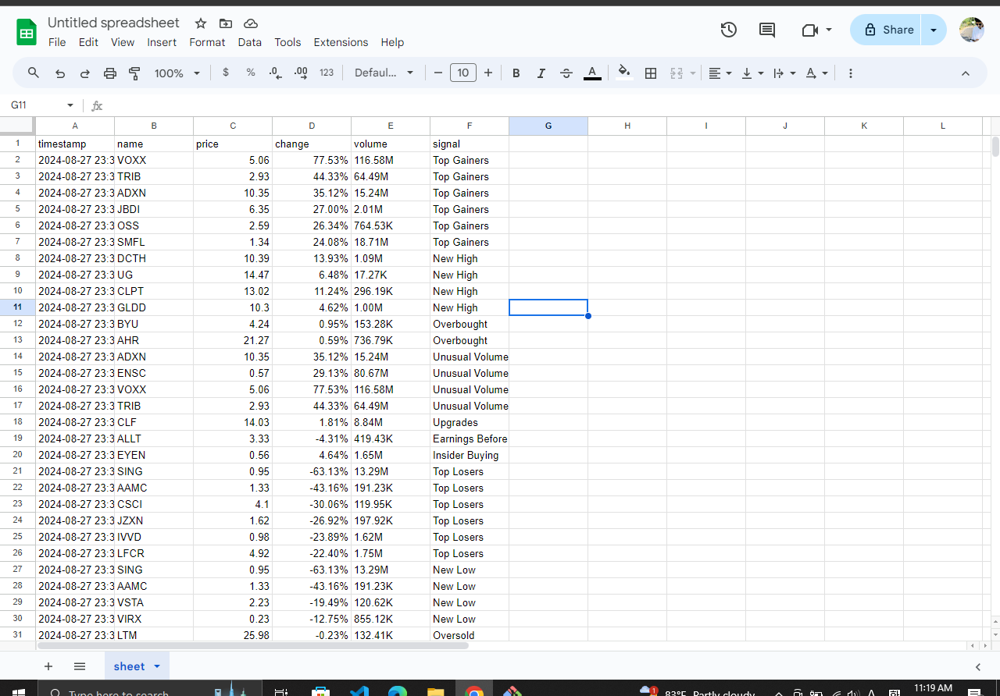

Rewrite the entire code from scratch.v2
*New features 
      *add sms api
      *store data in Google sheet using customer API

To work with this, should add the js file of code to the Google sheet customer script.
more details  "https://github.com/onescales/google-sheet-api"

and Google sheet looks like this

